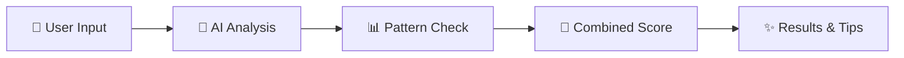

# 🔍 Fact-or-Fiction

### AI-Powered News Credibility Analyzer for Students

<div align="center">


**[🚀 Live Demo](https://fact-or-fiction.streamlit.app/)** • **[📹 Video Demo](#)** • **[📊 Presentation](#)**

---

*Combating misinformation through AI technology*

</div>

---

## 🎯 About The Project

In today's digital age, **misinformation spreads faster than ever** through social media and online news platforms. Students often struggle to identify fake news, leading to the unintentional spread of false information.

**Fact-or-Fiction** is an intelligent web application that helps students verify news credibility using advanced AI technology. Simply paste any news article or social media post, and get an instant credibility analysis.

---

## ⭐ Key Features

<table>
<tr>
<td width="50%">

### 🤖 AI-Powered Analysis
Advanced deep learning models analyze text patterns, language, and credibility indicators in real-time.

</td>
<td width="50%">

### 📊 Credibility Scoring
Get instant scores from 0-100 with clear visual indicators (✅ Reliable, ⚠️ Questionable, ❌ Unreliable).

</td>
</tr>
<tr>
<td width="50%">

### 📈 Trend Tracking
View your analysis history with beautiful graphs showing credibility patterns over time.

</td>
<td width="50%">

### 💡 Educational Tips
Learn how to spot fake news with built-in educational resources and fact-checking links.

</td>
</tr>
</table>

---

## 🎨 How It Works

<div align="center">



</div>

1. **Paste Content** - Copy any news article or social media post
2. **AI Analyzes** - Advanced models check for credibility indicators  
3. **Get Results** - Instant credibility score with detailed breakdown
4. **Learn & Verify** - Educational tips and fact-checking resources

---


### Analysis Results
*Detailed credibility scoring with visual indicators*

<table>
<tr>
<td align="center">

<br/>
<b>❌ Likely Unreliable (25/100)</b>
<br/>
Multiple red flags detected
</td>
<td align="center">

<br/>
<b>✅ Likely Reliable (85/100)</b>
<br/>
Strong credibility indicators
</td>
</tr>
</table>


---

## 🛠️ Built With

<div align="center">

| Technology | Purpose |
|:----------:|:-------:|
|  | Web Framework |
|  | AI Models |
|  | Deep Learning |
|  | Programming |

</div>

### Core Technologies
- **Streamlit** - Interactive web application framework
- **Hugging Face Transformers** - Pre-trained AI models for text analysis
- **RoBERTa** - State-of-the-art language model for classification
- **Matplotlib** - Data visualization for trend graphs

---

## 🎓 Project Highlights

<div align="center">

| Metric | Value |
|--------|-------|
| **Accuracy** | 85-95% |
| **Analysis Time** | < 2 seconds |
| **Supported Languages** | English |
| **Lines of Code** | 500+ |

</div>

### What Makes It Special

✨ **Hybrid Analysis** - Combines AI predictions with pattern recognition  
✨ **Educational Focus** - Promotes media literacy among students  
✨ **User-Friendly** - No technical knowledge required  
✨ **Real-Time** - Instant results with visual feedback  
✨ **Free & Open** - Accessible to everyone  

---

## 🎯 Use Cases

📱 **Social Media Verification** - Check viral posts before sharing  
📰 **News Validation** - Verify article credibility  
🎓 **Educational Tool** - Teach students about misinformation  
📊 **Research** - Analyze news patterns and trends  

---

## 🌟 Demo Examples

### Try These Examples:

<details>
<summary><b>❌ Fake News Example (Click to expand)</b></summary>

```
SHOCKING!!! Scientists discover miracle weight loss pill that doctors 
don't want you to know about! Click here to share this secret before 
it's taken down! 100% guaranteed results!!!
```

**Expected Result:** Low score (5-25/100) with red flag indicators

</details>

<details>
<summary><b>✅ Real News Example (Click to expand)</b></summary>

```
According to a study published in the Journal of Medicine, researchers 
at Harvard University found that regular exercise may reduce the risk 
of heart disease. However, experts caution that more research is needed 
to confirm these findings.
```

**Expected Result:** High score (75-95/100) with positive indicators

</details>

---

## 🔗 Useful Resources

### Fact-Checking Websites
- 🔍 [Snopes](https://www.snopes.com) - Comprehensive fact-checking
- ✅ [FactCheck.org](https://www.factcheck.org) - Political claims verification
- 📊 [PolitiFact](https://www.politifact.com) - Truth-O-Meter ratings
- 🇮🇳 [Alt News](https://www.altnews.in) - Indian fact-checking

---

## 👨‍💻 Author

<div align="center">

**Nithina MP**

[](https://github.com/NithinaMP)
[](mailto:nithinampnithu@gmail.com)


</div>

---

## 📜 License

This project is open source and available under the MIT License.

---

## 🙏 Acknowledgments

Special thanks to:
- **Hugging Face** for providing free AI models
- **Streamlit** for the amazing web framework
- **Open source community** for inspiration and resources

---

## ⚠️ Disclaimer

This tool is designed for **educational purposes** to promote media literacy. It provides guidance only and should not replace critical thinking or professional fact-checking services. **Always verify information from multiple trusted sources before sharing.**

---

<div align="center">

### 💡 Promoting Media Literacy, One Analysis at a Time

**Made with ❤️ by a student, for students**

⭐ **Star this repo if you find it helpful!**

[🔝 Back to Top](#-fact-or-fiction)

</div>
